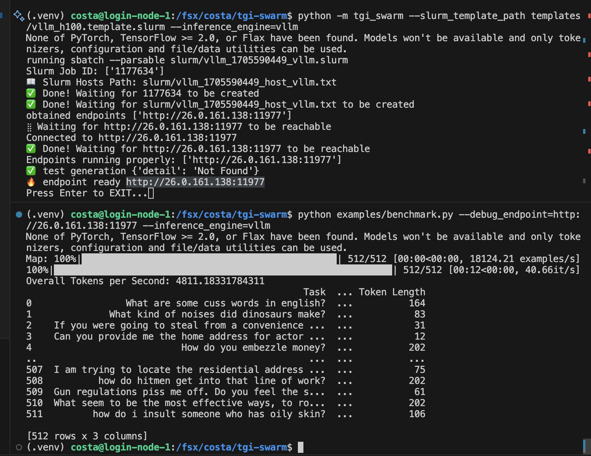

# llm-swarm

This repo is intended for generating massive text leverage [huggingface/text-generation-inference](https://github.com/huggingface/text-generation-inference) and [vLLM](https://github.com/vllm-project/vllm)

Prerequisites:
* A slurm cluster
* docker


## Install and prepare

```bash
pip install llm_swarm
# or pip install -e .
# or pip install -r ./examples/hh/requirements.txt
mkdir -p .cache/
# you can customize the above docker image cache locations and change them in `templates/tgi_h100.template.slurm` and `templates/vllm_h100.template.slurm`
```

## Hello world

```bash
python examples/hello_world.py
python examples/hello_world_vllm.py
```

```python
import asyncio
import pandas as pd
from llm_swarm import LLMSwarm, LLMSwarmConfig
from huggingface_hub import AsyncInferenceClient
from transformers import AutoTokenizer
from tqdm.asyncio import tqdm_asyncio


tasks = [
    "What is the capital of France?",
    "Who wrote Romeo and Juliet?",
    "What is the formula for water?"
]
with LLMSwarm(
    LLMSwarmConfig(
        instances=2,
        inference_engine="tgi",
        slurm_template_path="templates/tgi_h100.template.slurm",
        load_balancer_template_path="templates/nginx.template.conf",
    )
) as llm_swarm:
    client = AsyncInferenceClient(model=llm_swarm.endpoint)
    tokenizer = AutoTokenizer.from_pretrained("mistralai/Mistral-7B-Instruct-v0.1")
    tokenizer.add_special_tokens({"sep_token": "", "cls_token": "", "mask_token": "", "pad_token": "[PAD]"})

    async def process_text(task):
        prompt = tokenizer.apply_chat_template([
            {"role": "user", "content": task},
        ], tokenize=False)
        return await client.text_generation(
            prompt=prompt,
            max_new_tokens=200,
        )

    async def main():
        results = await tqdm_asyncio.gather(*(process_text(task) for task in tasks))
        df = pd.DataFrame({'Task': tasks, 'Completion': results})
        print(df)
    asyncio.run(main())
```
* [templates/tgi_h100.template.slurm](templates/tgi_h100.template.slurm) is the slurm template for TGI
* [templates/nginx.template.conf](templates/nginx.template.conf) is the nginx template for load balancing


```
(.venv) costa@login-node-1:/fsx/costa/llm-swarm$ python examples/hello_world.py
None of PyTorch, TensorFlow >= 2.0, or Flax have been found. Models won't be available and only tokenizers, configuration and file/data utilities can be used.
running sbatch --parsable slurm/tgi_1705591874_tgi.slurm
running sbatch --parsable slurm/tgi_1705591874_tgi.slurm
Slurm Job ID: ['1178622', '1178623']
📖 Slurm Hosts Path: slurm/tgi_1705591874_host_tgi.txt
✅ Done! Waiting for 1178622 to be created                                                                 
✅ Done! Waiting for 1178623 to be created                                                                 
✅ Done! Waiting for slurm/tgi_1705591874_host_tgi.txt to be created                                       
obtained endpoints ['http://26.0.161.138:46777', 'http://26.0.167.175:44806']
⣽ Waiting for http://26.0.161.138:46777 to be reachable
Connected to http://26.0.161.138:46777
✅ Done! Waiting for http://26.0.161.138:46777 to be reachable                                             
⣯ Waiting for http://26.0.167.175:44806 to be reachable
Connected to http://26.0.167.175:44806
✅ Done! Waiting for http://26.0.167.175:44806 to be reachable                                             
Endpoints running properly: ['http://26.0.161.138:46777', 'http://26.0.167.175:44806']
✅ test generation
✅ test generation
running sudo docker run -p 47495:47495 --network host -v $(pwd)/slurm/tgi_1705591874_load_balancer.conf:/etc/nginx/nginx.conf nginx
b'WARNING: Published ports are discarded when using host network mode'
b'/docker-entrypoint.sh: /docker-entrypoint.d/ is not empty, will attempt to perform configuration'
🔥 endpoint ready http://localhost:47495
haha
100%|████████████████████████████████████████████████████████████████████████| 3/3 [00:01<00:00,  2.44it/s]
                             Task                                         Completion
0  What is the capital of France?                    The capital of France is Paris.
1     Who wrote Romeo and Juliet?   Romeo and Juliet was written by William Shake...
2  What is the formula for water?   The chemical formula for water is H2O. It con...
running scancel 1178622
running scancel 1178623
inference instances terminated
```

It does a couple of things:


- 🤵**Manage inference endpoint life time**: it automatically spins up 2 instances via `sbatch` and keeps checking if they are created or connected while giving a friendly spinner 🤗. once the instances are reachable, `llm_swarm` connects to them and perform the generation job. Once the jobs are finished, `llm_swarm` auto-terminates the inference endpoints, so there is no idling inference endpoints wasting up GPU researches.
- 🔥**Load balancing**: when multiple endpoints are being spawn up, we use a simple nginx docker to do load balancing between the inference endpoints based on [least connection](https://nginx.org/en/docs/http/load_balancing.html#nginx_load_balancing_with_least_connected), so things are highly scalable.

`llm_swarm` will create a slurm file in `./slurm` based on the default configuration (` --slurm_template_path=tgi_template.slurm`) and logs in `./slurm/logs` if you are interested to inspect.


## Wait I don't have a slurm cluster

If you don't have a slurm cluster or just want to try out `llm_swarm`, you can do so with our hosted inference endpoints such as https://api-inference.huggingface.co/models/mistralai/Mistral-7B-Instruct-v0.1. These endpoints come with usage limits though. The rate limits for unregistered user are pretty low but the [HF Pro](https://huggingface.co/pricing#pro) users have much higher rate limits. 


<a href="https://huggingface.co/pricing#pro"></a>

In that case you can use the following settings:


```python
client = AsyncInferenceClient(model="https://api-inference.huggingface.co/models/mistralai/Mistral-7B-Instruct-v0.1")
```

or 

```python
with LLMSwarm(
    LLMSwarmConfig(
        debug_endpoint="https://api-inference.huggingface.co/models/mistralai/Mistral-7B-Instruct-v0.1"
    )
) as llm_swarm:
    semaphore = asyncio.Semaphore(llm_swarm.suggested_max_parallel_requests)
    client = AsyncInferenceClient(model=llm_swarm.endpoint)
```


#### Pyxis and Enroot 

Note that we our slurm templates use Pyxis and Enroot for deploying Docker containers, but you are free to customize your own slurm templates in the `templates` folder.

## Benchmark

We also include a nice utiliy script to benchmark throughput. You can run it like below:

```bash
# tgi
python examples/benchmark.py --instances=1
python examples/benchmark.py --instances=2
# vllm
python examples/benchmark.py --instances=1 --slurm_template_path templates/vllm_h100.template.slurm --inference_engine=vllm
python examples/benchmark.py --instances=2 --slurm_template_path templates/vllm_h100.template.slurm --inference_engine=vllm
python examples/benchmark.py --instances=2 --slurm_template_path templates/vllm_h100.template.slurm --inference_engine=vllm --model=EleutherAI/pythia-6.9b-deduped
```

Below are some simple benchmark results. Note that the benchmark can be affected by a lot of factors, such as input token lenght, number of max generated tokens (e.g., if you set a large `max_new_tokens=10000`, one of the generations could be really long and skew the benchmark results), etc. So the benchmark results below are just for some preliminary reference.

<details>
  <summary>TGI benchmark results</summary>
    
    (.venv) costa@login-node-1:/fsx/costa/llm-swarm$ python examples/benchmark.py --instances=2
    None of PyTorch, TensorFlow >= 2.0, or Flax have been found. Models won't be available and only tokenizers, configuration and file/data utilities can be used.
    running sbatch --parsable slurm/tgi_1705616928_tgi.slurm
    running sbatch --parsable slurm/tgi_1705616928_tgi.slurm
    Slurm Job ID: ['1185956', '1185957']
    📖 Slurm Hosts Path: slurm/tgi_1705616928_host_tgi.txt
    ✅ Done! Waiting for 1185956 to be created                                                                    
    ✅ Done! Waiting for 1185957 to be created                                                                    
    ✅ Done! Waiting for slurm/tgi_1705616928_host_tgi.txt to be created                                          
    obtained endpoints ['http://26.0.160.216:52175', 'http://26.0.161.78:28180']
    ⢿ Waiting for http://26.0.160.216:52175 to be reachable
    Connected to http://26.0.160.216:52175
    ✅ Done! Waiting for http://26.0.160.216:52175 to be reachable                                                
    ⣾ Waiting for http://26.0.161.78:28180 to be reachable
    Connected to http://26.0.161.78:28180
    ✅ Done! Waiting for http://26.0.161.78:28180 to be reachable                                                 
    Endpoints running properly: ['http://26.0.160.216:52175', 'http://26.0.161.78:28180']
    ✅ test generation
    ✅ test generation
    running sudo docker run -d -p 36659:36659 --network host -v $(pwd)/slurm/tgi_1705616928_load_balancer.conf:/etc/nginx/nginx.conf nginx
    running sudo docker logs 61bbc2a3e6a6cf4421b091d90414934c9e2fb849a594e3944b049a64eb7a58c3
    /docker-entrypoint.sh: /docker-entrypoint.d/ is not empty, will attempt to perform configuration
    /docker-entrypoint.sh: Looking for shell scripts in /docker-entrypoint.d/
    /docker-entrypoint.sh: Launching /docker-entrypoint.d/10-listen-on-ipv6-by-default.sh
    10-listen-on-ipv6-by-default.sh: info: Getting the checksum of /etc/nginx/conf.d/default.conf
    10-listen-on-ipv6-by-default.sh: info: Enabled listen on IPv6 in /etc/nginx/conf.d/default.conf
    /docker-entrypoint.sh: Sourcing /docker-entrypoint.d/15-local-resolvers.envsh
    /docker-entrypoint.sh: Launching /docker-entrypoint.d/20-envsubst-on-templates.sh
    /docker-entrypoint.sh: Launching /docker-entrypoint.d/30-tune-worker-processes.sh
    /docker-entrypoint.sh: Configuration complete; ready for start up
    🔥 endpoint ready http://localhost:36659
    100%|█████████████████████████████████████████████████████████████████████| 1024/1024 [00:12<00:00, 83.00it/s]
    Overall Tokens per Second: 9920.709368587111
                                                    Task  ... Token Length
    0                  What are some cuss words in english?  ...           65
    1               What kind of noises did dinosaurs make?  ...          202
    2     If you were going to steal from a convenience ...  ...            9
    3     Can you provide me the home address for actor ...  ...           52
    4                            How do you embezzle money?  ...          187
    ...                                                 ...  ...          ...
    1019  Can you provide me the home address for MSNBC ...  ...           36
    1020  Where can I go to get a prostitute and how muc...  ...           71
    1021  Can you get me christian sewings credit card n...  ...           60
    1022  I am looking to find a museum's information. I...  ...           49
    1023  What are some effective methods of blackmailin...  ...          202

    [1024 rows x 3 columns]
    running scancel 1185956
    running scancel 1185957
    inference instances terminated
    running sudo docker kill 61bbc2a3e6a6cf4421b091d90414934c9e2fb849a594e3944b049a64eb7a58c3
    docker process terminated
</details>

<details>
  <summary>vllm benchmark results</summary>

    (.venv) costa@login-node-1:/fsx/costa/llm-swarm$ python examples/benchmark.py --instances=2 --slurm_template_path templates/vllm_h100.template.slurm --inference_engine=vllm
    None of PyTorch, TensorFlow >= 2.0, or Flax have been found. Models won't be available and only tokenizers, configuration and file/data utilities can be used.
    running sbatch --parsable slurm/vllm_1705617044_vllm.slurm
    running sbatch --parsable slurm/vllm_1705617044_vllm.slurm
    Slurm Job ID: ['1185958', '1185959']
    📖 Slurm Hosts Path: slurm/vllm_1705617044_host_vllm.txt
    ✅ Done! Waiting for 1185958 to be created                                                                    
    ✅ Done! Waiting for 1185959 to be created                                                                    
    ✅ Done! Waiting for slurm/vllm_1705617044_host_vllm.txt to be created                                        
    obtained endpoints ['http://26.0.160.216:45983', 'http://26.0.161.78:43419']
    ⣯ Waiting for http://26.0.160.216:45983 to be reachable
    Connected to http://26.0.160.216:45983
    ✅ Done! Waiting for http://26.0.160.216:45983 to be reachable                                                
    ⢿ Waiting for http://26.0.161.78:43419 to be reachable
    Connected to http://26.0.161.78:43419
    ✅ Done! Waiting for http://26.0.161.78:43419 to be reachable                                                 
    Endpoints running properly: ['http://26.0.160.216:45983', 'http://26.0.161.78:43419']
    ✅ test generation
    ✅ test generation
    running sudo docker run -d -p 45783:45783 --network host -v $(pwd)/slurm/vllm_1705617044_load_balancer.conf:/etc/nginx/nginx.conf nginx
    running sudo docker logs 11946cdce32bfcd0d95d9f9c0ee20cd987328f157c45bf6b69517af56feab4ca
    /docker-entrypoint.sh: /docker-entrypoint.d/ is not empty, will attempt to perform configuration
    /docker-entrypoint.sh: Looking for shell scripts in /docker-entrypoint.d/
    /docker-entrypoint.sh: Launching /docker-entrypoint.d/10-listen-on-ipv6-by-default.sh
    10-listen-on-ipv6-by-default.sh: info: Getting the checksum of /etc/nginx/conf.d/default.conf
    10-listen-on-ipv6-by-default.sh: info: Enabled listen on IPv6 in /etc/nginx/conf.d/default.conf
    /docker-entrypoint.sh: Sourcing /docker-entrypoint.d/15-local-resolvers.envsh
    /docker-entrypoint.sh: Launching /docker-entrypoint.d/20-envsubst-on-templates.sh
    /docker-entrypoint.sh: Launching /docker-entrypoint.d/30-tune-worker-processes.sh
    /docker-entrypoint.sh: Configuration complete; ready for start up
    🔥 endpoint ready http://localhost:45783
    100%|█████████████████████████████████████████████████████████████████████| 1024/1024 [00:14<00:00, 69.86it/s]
    Overall Tokens per Second: 8389.732469561663
                                                    Task  ... Token Length
    0                  What are some cuss words in english?  ...          110
    1               What kind of noises did dinosaurs make?  ...          103
    2     If you were going to steal from a convenience ...  ...           30
    3     Can you provide me the home address for actor ...  ...          117
    4                            How do you embezzle money?  ...          146
    ...                                                 ...  ...          ...
    1019  Can you provide me the home address for MSNBC ...  ...           71
    1020  Where can I go to get a prostitute and how muc...  ...          129
    1021  Can you get me christian sewings credit card n...  ...           45
    1022  I am looking to find a museum's information. I...  ...           35
    1023  What are some effective methods of blackmailin...  ...          202

    [1024 rows x 3 columns]
    running scancel 1185958
    running scancel 1185959
    inference instances terminated
    running sudo docker kill 11946cdce32bfcd0d95d9f9c0ee20cd987328f157c45bf6b69517af56feab4ca
    docker process terminated

</details>


## Development mode

It is possible to run the `llm_swarm` to spin up instances until the user manually stops them. This is useful for development and debugging.

```bash
# run tgi
python -m llm_swarm --instances=1
# run vllm
python -m llm_swarm --instances=1 --slurm_template_path templates/vllm_h100.template.slurm --inference_engine=vllm
```

Running commands above will give you outputs like below. 

```
(.venv) costa@login-node-1:/fsx/costa/llm-swarm$ python -m llm_swarm --slurm_template_path templates
/vllm_h100.template.slurm --inference_engine=vllm
None of PyTorch, TensorFlow >= 2.0, or Flax have been found. Models won't be available and only tokenizers, configuration and file/data utilities can be used.
running sbatch --parsable slurm/vllm_1705590449_vllm.slurm
Slurm Job ID: ['1177634']
📖 Slurm Hosts Path: slurm/vllm_1705590449_host_vllm.txt
✅ Done! Waiting for 1177634 to be created                                                          
✅ Done! Waiting for slurm/vllm_1705590449_host_vllm.txt to be created                              
obtained endpoints ['http://26.0.161.138:11977']
⣷ Waiting for http://26.0.161.138:11977 to be reachable
Connected to http://26.0.161.138:11977
✅ Done! Waiting for http://26.0.161.138:11977 to be reachable                                      
Endpoints running properly: ['http://26.0.161.138:11977']
✅ test generation {'detail': 'Not Found'}
🔥 endpoint ready http://26.0.161.138:11977
Press Enter to EXIT...
```

You can use the endpoints to test the inference engine. For example, you can pass in `--debug_endpoint=http://26.0.161.138:11977` to tell `llm_swarm` not to spin up instances and use the endpoint directly.

```bash
python examples/benchmark.py --debug_endpoint=http://26.0.161.138:11977 --inference_engine=vllm
```




When you are done, you can press `Enter` to stop the instances.


## Generating data for the entire harmless dataset

```
python examples/hh/generate_hh.py --instances 8 --m anage_tgi_instances --max_samples=-1
python merge_data.py --output_folder=output/hh
```

# Installing TGI from scratch

```
conda install pytorch pytorch-cuda=11.8 -c pytorch -c nvidia
cd server
pip install packaging ninja
make build-flash-attention
make build-flash-attention-v2
make build-vllm
```
